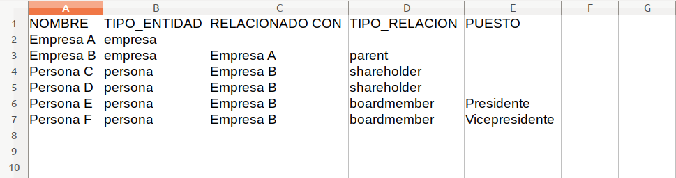

# Importing data

### Contracting data

For this section, the contracting directory you want to visualize must be formatted in [OCDS](http://standard.open-contracting.org/latest/en/), the open contracting standard format. You can use the [Kingfisher](https://github.com/open-contracting/kingfisher) tool to save to a local drive the listing of some OCDS sources. For more information, you can check Kingfisher's [full documentation](https://ocdskingfisher.readthedocs.io/en/latest/). You can also check the [OCDS Publisher](https://www.open-contracting.org/why-open-contracting/worldwide/#/table) full directory, which is updated quarterly.

OCDS standard is a model to publish and analyze contracting processes data. Data published under this standard is on [JSON](https://www.json.org/json-es.html) format and can appear in two ways: [release](http://standard.open-contracting.org/latest/en/schema/reference/) and [record](http://standard.open-contracting.org/latest/en/schema/records_reference/). Generally, OCDS data is published in contracting processes directories, known as packages. You can find [Release Packages](http://standard.open-contracting.org/latest/en/schema/release_package/) and [Record Packages](http://standard.open-contracting.org/latest/en/schema/record_package/) posted by governments of certain countries.

Data must be on a file named **contracts.json** and the file will be located in *assets/data/*. To upload the file to the GitHub repository:

* Browse to the repository’s home page. 
* On the files directory, click on the *assets file*.
* At the next page, click on the file named *data*. 
* Once into the folder, click on "Upload files", located in the file's directory on the right corner of the screen. This will take you to another page.
* Choose the file from your computer or drag it into the browser. If you can't see the button to upload files, you must log into GitHub with your username and password.

The data file must have a directory of records, or contracting processes releases. If a file stored in an array has to be an only records or releases directory, you might need to manipulate the file content. For this, we recommend the [ocdskit](https://github.com/open-contracting/ocdskit) and [jq](https://stedolan.github.io/jq/) tools.

**Contracts.json file structure**

Contracts.json file must keep to the structure of one of the following sort of data: [Release Package](http://standard.open-contracting.org/latest/en/schema/release_package/) or [Record Package](http://standard.open-contracting.org/latest/en/schema/record_package/).

A **Release Package** is a Json object with a property called «releases», which contains an array directory, indicated by brackets []. Its elements are individual objects of a [release](http://standard.open-contracting.org/latest/en/schema/reference/) type, separated by commas (,). Each release type object corresponds to an individual contracting process.
```
{
    "releases": [
        { (release 1) },
        { (release 2) },
        ...
        { (release n) }
    ]
}
```

A **Record Package**  is a Json object with a property called «records», which contains an array directory, indicated by brackets []. Its elements are individual objects of a [record](http://standard.open-contracting.org/latest/en/schema/records_reference/) type, separated by commas (,). Each object of a record type is composed, in turn, of two properties: a «releases» property, which must keep to the same format as the Release Packages described before; and another property called «compiledRelease», which contains an individual object of a [release](http://standard.open-contracting.org/latest/en/schema/reference/) type. Each release type object corresponds to an individual contracting process. The releases directory inside a record type of object contains the revision log for a contracting process, and the compiledRelease object contains the last version of each individual data of the same contract.
```
{
    "records": [
        {
            "releases": [
                { (release 1) },
                { (release 2) },
                ...
                { (release n) }
            ],
            "compiledRelease": { (última versión del release) }
        },
        { (record 2) },
        ...
        { (record n) }
    ]
}
```

Note: Inside each release, certain fields need to contain some value so the graphics will display correctly. The mandatory fields are:
- *ocid*
- *tender.title*
- *tender.mainProcurementCategory*
- *tender.procurementMethodDetails*
- *contracts.value.amount*
- *contracts.value.currency*
- Inside the field “parties”, there should be at least one with *role: ["supplier"]* and values for the *id* and *name* fields.

**Guide: Create a contracts directory manually**

1. Browse to a repository or open data API that offers OCDS-format contracting downloads. For this guide, we'll use the API of Mexico’s government website: [https://api.datos.gob.mx/](https://api.datos.gob.mx/).
2. For this example, we'll use a query for a JSON-format contracting directory. 
3. Right-click [this link](https://api.datos.gob.mx/v2/Releases_SFP) and select “Save link as…”, then proceed to save the .json file.
4. Open a command prompt and browse to the downloaded file location. If you've never used a command prompt, you can read the following tutorials to learn more: [Linux](https://openwebinars.net/blog/La-guia-definitiva-para-aprender-a-usar-la-terminal-de-Linux/) / [Windows](https://www.abrirllave.com/cmd/guion-del-tutorial.php) / [Mac](http://foro-mac.com.ar/tutorial-como-usar-la-terminal-en-mac/).
5. Use **jq** to work with JSON data and structure it as you need. You'll find download and installation instructions for your operating system over [here](https://stedolan.github.io/jq/download/). You can learn how to use jq reading the [official manual](https://stedolan.github.io/jq/manual/).
6. The API response consists of a root object that contains, among other things, the "results" property. The "results" value is the OCDS contracting directory that you need for TowerBuilder. With the following command (in Linux), you can take the directory, set it inside an object named "releases", and save it on a file under the name *contracts.json*:
    ```
    cat Releases_SFP.json | jq '{releases: .results}' > contracts.json
    ```
    - *cat Releases_SFP.json* read the Releases_SFP.json content and display it on screen.
    - *| jq* take the result of the previous command and send it to the jq command as input.
    - *{releases: .results}* filters the JSON received as input, take the "results" property value and save it on a new property named "releases".
    - *> contracts.json* takes the result of the previous filter and saves it as a file called "contracts.json", in the current folder.
7. Copy the file contracts.json to *assets/data/* in your repository, as explained in the previous section.

### Actual Beneficiaries Data

In order to complement the contracting processes data, you can display relations between it and the people and enterprises behind the entities that appear on data published under OCDS. Relations are expressed as a hierarchy tree, where relations are established. They can be among companies, like a parent company and its subsidiaries; or among companies and people, like shareholders and board of directors members. This hierarchy tree allows establishing who the beneficial owners of the analyzed contracting processes are.

> An Actual Beneficiary is any individual who, either directly or indirectly, owns, influences, controls and/or benefits of at least 5% of an asset through a corporation, commercial society or trust. 
For more information about Actual Beneficiaries, click [here](https://www.colaboratorio.org/beneficiarios-reales-en-mexico/).

To create the Actual Beneficiaries dataset, download the template available in *assets/data/BO-template.csv*, and edit its values with a spreadsheet software, such as LibreOffice Calc, Excel, Google Spreadsheets, etc. The file contains the following columns:

1. **NAME:** the entity name (individual or enterprise) as shown on the OCDS data.
2. **TYPE_ENTITY:** "*company*" or "*individual*" depending on the entity defined on the first column.
3. **RELATED_TO:** The entity you want to define the relation with.
4. **TYPE_RELATIONSHIP:** How the entity on the first column is related to the entity on the third column. It may contain the following values:
    - "*parent*" to establish that the third column's company is a subsidiary of the first column's company.
    - "*shareholder*" when the first column's individual is a shareholder of the third column's company.
    - "*boardmember*" if the first column's individual is part of the board of directors of the third column's company.
5. **PUESTO:** the position name the individual holds. It only applies to a TYPE_RELATIONSHIP with a value of "*boardmember*".

Each row represents a branch of the hierarchy tree, starting from a base row that will only contain the company name on the first column and the word "company" on the second one. You should introduce the company name on each row, exactly as it appears on the contracting directory, so the graph can link the information. 
Let’s look at the following hierarchy:

- **Company A** (1) appears on a contracting process.
- **Company B** (2) is the parent company of **Company A**.
- **Individual C** (3) and **Individual D** (4) are shareholders of **Company B**.
- **Individual E** (5) and **Individual F** (6) son el **President** and **Vice-president** of**Company B**'s board of directors.

You must fill in the file in the following way, using one row per entity:



Repeat the same process for each company’s hierarchy you have data from. Once the file is complete, you can repeat the same procedure from the previous section to upload it to *assets/data/*. The file must be named **owners.csv**.
