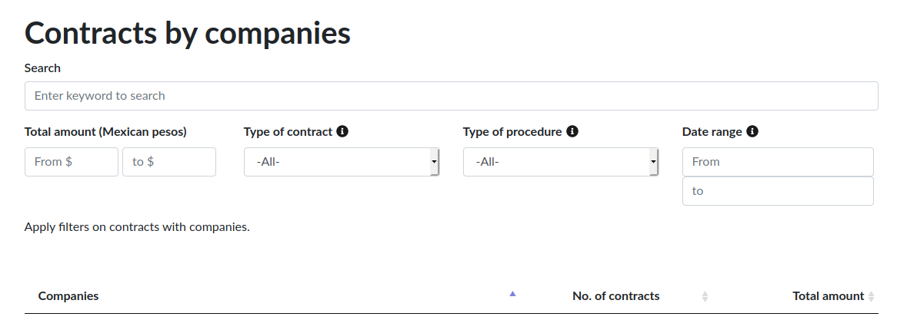

# Editing texts

Editable text files are in MarkDown (.md) format.

Markdown is a light and user-friendly syntax used to style web texts. You are in control of the document visualization: you can bolden or italicize text, add images and create lists, among other things that can be done with MarkDown. Broadly speaking, Markdown is just plain text with some non-alphabetical characters, such as `#` or `*`.

We recommend reading [Github's Markdown guide](https://guides.github.com/features/mastering-markdown/) to learn more about it.

## Main texts

Main texts are composed of sections that appear on the main menu.

To edit files:

1. On GitHub's repository, click on the title of the file you want to modify.
2. Click on the pencil icon located on the upper right corner (Edit this file).
3. Edit the text using Markdown format.
4. Once finished, go to the **Commit changes** section, underneath the edit section. Add a short description of changes you've made on the first box and, optionally, a longer description in the second box.
5. Save changes by clicking the green **Commit changes** button.

List of editable documents:


### Home page

The main page consists of nine sections, each section is an editable file in markdown and contains variables with different options to configure the section, they are located in the **collections** folder as shown below:
  - **collections/_home/1-main.md**
  - **collections/_home/2-intro.md**
  - **collections/_home/3-section.md**
  - **collections/_home/4-section.md**
  - **collections/_home/5-section.md**
  - **collections/_home/6-highlight-section.md**
  - **collections/_home/7-section.md**
  - **collections/_home/8-section.md**
  - **collections/_home/9-contacto.md**

You can change the name of these files, but keeping the numbering according to the order you want to follow in the final site.

Below we show and explain the variables that you must modify within the file of each section according to the content that you are going to add:

#### Cover page, file **1-main.md**
In this section you can display a background image that occupies the entire screen, a main title or a logo, a short text and buttons.

Variables:

```
---
title: Home -> # The title of the section, this will be displayed in the menu that will appear on the right side of the screen.
main-section: true -> # Activate the styles, the main background image and the highlighted texts will display.
main-logo: todosloscontratoscr-logo-blanco.png -> # If you want to show your logo, add the name of the file that should already be in the folder **assets/img/**.

# Column options
one-column-section: true -> # It must be activated to show the section in a single column
---
```
Content:

Below the variables section, you can add the short text and buttons you need, in markdown format. We recommend keeping the length of the text found as an example.

#### Introduction, file **2-intro.md**
In this section you can add a title, text, subtitles and add an image, video or iframe and a button. There is also the option to activate a notes section that will appear below.

Variables:

```
---
title: Introduction -> # Section title
cta-button-section: true -> # Activate if you want to show a button at the end of the section
button:
  link: "https://projectpoder.github.io/tolococr/" -> # Url button
  text: "Botón"  -> # Name button
# Media section
media: true -> # Activate to add an image, video or iframe, only choose one option
media-type: # Fill only one option
  image: -> # Add the name of the file that should already be in the folder assets/img
  iframe: https://link.com -> # Add iframe link
  video: https://youtube.com -> # Add video link

# If iframe, set the different iframe size, depending of de size screen
iframe-size: -> # This option will work if you added an iframe, you will be able to set the height of the iframe depending on the size of the screen
  xl-size: "20%" # Extra large screen ≥1280px
  lg-size: "30%" # Large screen ≤1279px
  md-size: "50%" # Medium screen ≤992px
  sm-size: "100%" # Small screen ≤768px
  xs-size: "120%" # Extra screen small <576px

# Column options
one-column-section: true -> # Activate to display the content in a single column

# Section background and text colors
background-color: "#ffffff" -> # Choose a background color of the section
text-color: "#333333" -> # Choose the color text of the section

# Article information -> # These variables activate the articles of this section
articles: true -> # Show articles
articles-section:
  background-color: "#EFEFEF" -> # Modify the background color of the entire article section
# Article 1
article-content: -> # Add an article information as the example text
  title: Article title
  author: Marisol Carrillo
  organization: PODER
  description: Proin tempus vehicula nibh, et mollis erat consequat sit amet. Aliquam molestie, elit feugiat sagittis luctus, ex lorem ultrices elit, ac molestie orci elit eu nisi. Phasellus accumsan fringilla ligula, id vulputate lorem bibendum in. Fusce congue ullamcorper tempus. In metus velit, finibus et libero nec, tempus aliquam metus.
  image: bg-masthead.jpg
  link: https://github.com/ProjectPODER
# Article 2
article-content2: -> # Second article information
  title: Article title 2
  author: Marisol Carrillo
  organization: PODER
  description: Proin tempus vehicula nibh, et mollis erat consequat sit amet. Aliquam molestie, elit feugiat sagittis luctus, ex lorem ultrices elit, ac molestie orci elit eu nisi. Phasellus accumsan fringilla ligula, id vulputate lorem bibendum in. Fusce congue ullamcorper tempus. In metus velit, finibus et libero nec, tempus aliquam metus.
  image: bg-masthead.jpg
  link: https://github.com/ProjectPODER
---
```

Content:

After the variables section, you will be able to add text and subtitles in markdown format. You can add the text you want, there is no limit here.

#### One column general section, file **3-section.md**
Esta sección general, contiene un título, texto, la opción de mostrar una imagen, video o iframe, un botón y  una sección de notas. Es la misma estructura que la Introducción y se muestra en una sola columna.

Variables:

```
title: One column section
cta-button-section: true
button:
  link: "https://projectpoder.github.io/tolococr/"
  text: "Button"
# Media section
media: true
media-type:
  image: graphic-example1.png
  iframe:
  video:
# Column options
one-column-section: true

# Section background and text colors
background-color: "#ffffff"
text-color: "#333333"

# Article information
articles: true
articles-section:
  background-color: "#EFEFEF"
# Article 1
article-content:
  title: Article title
  author: Marisol Carrillo
  organization: PODER
  description: Proin tempus vehicula nibh, et mollis erat consequat sit amet. Aliquam molestie, elit feugiat sagittis luctus, ex lorem ultrices elit, ac molestie orci elit eu nisi. Phasellus accumsan fringilla ligula, id vulputate lorem bibendum in. Fusce congue ullamcorper tempus. In metus velit, finibus et libero nec, tempus aliquam metus.
  image: bg-masthead.jpg
  link: https://github.com/ProjectPODER
# Article 2
article-content2:
  title: Article title 2
  author: Marisol Carrillo
  organization: PODER
  description: Proin tempus vehicula nibh, et mollis erat consequat sit amet. Aliquam molestie, elit feugiat sagittis luctus, ex lorem ultrices elit, ac molestie orci elit eu nisi. Phasellus accumsan fringilla ligula, id vulputate lorem bibendum in. Fusce congue ullamcorper tempus. In metus velit, finibus et libero nec, tempus aliquam metus.
  image: bg-masthead.jpg
  link: https://github.com/ProjectPODER
```

Content:

After the variables section, you will be able to add text and subtitles in markdown format. You can add the text you want, there is also no limit.

#### Two columns section, file **4-section.md**
In this section you can show a title, a text and an image, video or iframe in two columns and a colored background, the background color is taken from the primary color configuration of the site.

Variables:

```
---
title: Section 4
# Media section
media: true -> # Activate an image, video or iframe, only one option
media-type:
  image: graphic-example1.png -> Name of the file that should already be in the folder assets/img
  iframe: -> # Iframe link
  video: -> # Video link
# Column options
one-column-section: false -> # Deactivate one column
two-columns-section: true -> # Activate two columns
# If two columns is true
# Media position
media-left: false - > # In this section we will show the image, video or iframe in the right column if this option is false
# Section background and text colors
background-color: "#ffffff" -> # Select the background color of the entire section
text-color: "#ffffff" -> # Select the text color of the entire section

---
```

Content:

Add the title and the text in the left column, we recommend short text.

#### Two columns section, file **5-section.md**
This section is the same as the previous one, but you can show the image, video or iframe in the left column and show the article section below.

Variables:

```
---
title: section 5
# Media section
media: true
media-type:
  image:
  iframe:
  video: https://www.youtube.com/embed/TYCBicKyVhs -> # Add a video

# Column options
one-column-section: false
two-columns-section: true
# If two columns is true
# Media position
media-left: true -> # Activate the option to show the image, video or iframe in the left column
# Section background and text colors
background-color: "#ffffff"
text-color: "#ffffff"

# Article information
articles: true -> # Activate article section
articles-section:
  background-color: "#EFEFEF"
# Article 1
article-content:
  title: Título de la nota
  author: Marisol Carrillo
  organization: PODER
  description: Proin tempus vehicula nibh, et mollis erat consequat sit amet. Aliquam molestie, elit feugiat sagittis luctus, ex lorem ultrices elit, ac molestie orci elit eu nisi. Phasellus accumsan fringilla ligula, id vulputate lorem bibendum in. Fusce congue ullamcorper tempus. In metus velit, finibus et libero nec, tempus aliquam metus.
  image: bg-masthead.jpg
  link: https://github.com/ProjectPODER
# Article 2
article-content2:
  title: Título de la nota 2
  author: Marisol Carrillo
  organization: PODER
  description: Proin tempus vehicula nibh, et mollis erat consequat sit amet. Aliquam molestie, elit feugiat sagittis luctus, ex lorem ultrices elit, ac molestie orci elit eu nisi. Phasellus accumsan fringilla ligula, id vulputate lorem bibendum in. Fusce congue ullamcorper tempus. In metus velit, finibus et libero nec, tempus aliquam metus.
  image: bg-masthead.jpg
  link: https://github.com/ProjectPODER
---
```

Contenido:

Add the title and the text in the right column.

#### Highlight section, file **6-highlight-section.md**
In this section you can highlight content, it consists of a title, text and a button, you can modify the background color of the section and the box containing the text.

Variables:

```
---
title: Highlight
cta-button-section: true
button:
  link: "https://projectpoder.github.io/tolococr/"
  text: "Botón"
# Highlight section options
highlight-section: true -> # Activate to show the styles of the highlight section
highlight-section-background: "#006607" -> # Add a background color to the text container
# Column options
one-column-section: true -> # Show one column

# Section background and text colors
background-color: "#ffffff"
text-color: "#ffffff"
---
```

Content:

Add a title or subtitle and a highlight text.

#### General section in one column, file **7-section.md** y **8-section.md**
Esta sección muestra títulos, textos, imagen, video o iframe y un botón, en una columna. La configuración del ejemplo muestra secciones simples de texto.
This section shows titles, texts, image, video or iframe and a button, in one column. The example shows simple text sections.

Variables:

```
---
title: About the project
cta-button-section: false
button:
  link: "https://projectpoder.github.io/tolococr/"
  text: "Button"
# Media section
media: false
media-type:
  image:
  iframe:
  video:
# Column options
one-column-section: true

# Section background and text colors
background-color: "#ffffff"
text-color: "#333333"

---
```

Content:

Add headings or subheadings and paragraphs of text as needed. There is no text limit here.
#### Contact section, file **9-contacto.md**
You can add the title, a text and a link that goes to the place where you want to be contacted.

Variables:

```
---
title: Contact
cta-button-section: true
button:
  link: "https://projectpoder.github.io/tolococr/"
  text: "Button"

# Column options
one-column-section: true

# Section background and text colors
background-color: "#97C461"
text-color: "#333333"

---
```

Content:

Add a title and text.

#### Footer
To edit the footer, you'll need to edit the files in the **collections/_footer** folder. You will find two files called **column-1.md** or **column-2.md**, each file has variables to configure the section, where you can add a title and a logo.

Variables:

```
---
title: Project of -> # Column title
image-logo: logoPODER_19.png -> # File name that should be in the folder assets/img
image-name: PODER logo -> # Image name
width-logo: 100px -> # Image size
# If there are more logos
image-logo2: Innovaap_logo.png -> # You can add a second logo in the same column
image-name2: Innovaap logo
width-logo2: 170px
---
```
#### Embed Kibana iframes
We explain the steps to follow to embed a Kibana iframe correctly:

- In Kibana, select the share option to embed the visualization (it can be reached from the dashboard edit option).
- The visualization must be on Simona.
- Copy the visualization to public space from saved objects, searching by name, choosing "clone to space" and choosing public.
- Go to the public space, find the visualization, select share and then embed.
- The choice of snapshot or saved object depends on whether we want the numbers to be updated (saved object) or if we want them to always stay that way (snapshot).
- From the copied url, remove everything except the url that is in quotes in src.
- Put this url in the **iframe** variable of the section in which you want to add it.

Example:
```
title: Introduttion
cta-button-section: false
button:
  link:
  text:
# Media section
media: true
media-type: # Fill only one option
  image:
  # Add the iframe link
  iframe: "https://publico-simona.quienesquien.wiki/s/publico/app/visualize#/edit/e5b829d0-ca23-11eb-b96d-0715cd05503e?embed=true&_g=(filters:!(),refreshInterval:(pause:!t,value:0),time:(from:'2008',to:'2019'))&_a=(filters:!(),linked:!f,query:(language:kuery,query:''),uiState:(),vis:(aggs:!((enabled:!t,id:'1',params:(customLabel:'Cantidad%20de%20contratos'),schema:metric,type:count),(enabled:!f,id:'2',params:(customLabel:'Suma%20de%20monto',field:monto),schema:metric,type:sum),(enabled:!t,id:'3',params:(customLabel:'Cantidad%20de%20Adjudicatarios',field:adjudicatario.keyword),schema:metric,type:cardinality),(enabled:!t,id:'5',params:(customLabel:'Cantidad%20de%20Instituciones',field:institucion.keyword),schema:metric,type:cardinality),(enabled:!t,id:'6',params:(customLabel:'Cantidad%20de%20municipios',field:municipio.keyword),schema:metric,type:cardinality)),params:(addLegend:!f,addTooltip:!t,metric:(colorSchema:Greens,colorsRange:!((from:0,to:100),(from:100,to:10000),(from:10000,to:30000),(from:30000,to:40000),(from:40000,to:500000)),invertColors:!f,labels:(show:!t),metricColorMode:Background,percentageMode:!f,style:(bgColor:!f,bgFill:%23000,fontSize:60,labelColor:!f,subText:''),useRanges:!f),type:metric),title:SICOP_DASH_numeros,type:metric))"
  video:

# If iframe, set the different iframe size, depending of de size screen
iframe-size: -> # This option will work if you added an iframe, you will be able to set the height of the iframe depending on the size of the screen
  xl-size: "20%" # Extra large screen ≥1280px
  lg-size: "30%" # Large screen ≤1279px
  md-size: "50%" # Medium screen ≤992px
  sm-size: "100%" # Small screen ≤768px
  xs-size: "120%" # Extra screen small <576px
```

To edit texts on the About page:
  - **4-about.md**

To edit texts on each slide:
  - **collections/_first-slider/slide-1.md**
  - **collections/_first-slider/slide-2.md**
  - **collections/_first-slider/slide-3.md**

To add or remove a slide, just add or remove an **.md** file inside **_first-slider** folder.

If you want to change or add an image (.jpg, .png or .svg) inside the slider, you should add the image inside the **assets/img/** folder and add the file's name to the file corresponding to the slide where images will be.

```
---
title: First Slide
**image: graphic-example.png** -> file's name will be here.
---
```

To edit the visualization slider captions:
  - **collections/_visualization-slider/slide-1.md**
  - **collections/_visualization-slider/slide-2.md**
  - **collections/_visualization-slider/slide-3.md**


### Page names and permalinks

You can edit the name and permalink of each section that will be shown on the main menu.

To do this, find and edit this part:

```
---
layout: home
title: Home
permalink: /
---
```

To change the page's name, edit:

```
---
title: Page name
---
```

To change the permalink, edit:
```
---
permalink: /page-link/
---
```

### Changing the order of items on the main menu

Since TowerBuilder adds items to the main menu in alphabetical order, a custom order can be achieved by editing the numbers at the start of each file's name.

This is the default order:

1. home
2. slider.html
3. visualization-slider.html
4. contracts.html
5. posts.md
6. about.md
7. styleguide.md

These are the steps to edit the name of a GitHub file:

1. On GitHub's repository, click on the title of the file you want to modify.
2. Click on the pencil icon located on the upper right corner (*Edit this file*).
3. Edit the name in the filename box, located above the edit section.
4. Once finished, go to the **Commit changes** section, underneath the edit section. Add a short description of changes you've made on the first box and, optionally, a longer description in the second box.
5. Save changes by clicking the green **Commit changes** button.

<!-- **Note:** If you want to remove Style guide page from menu, you need to go to *_config.yml* configurations file and write the file's full name on the exclude section. It should be like this:

```
exclude:
  - Gemfile
  - Gemfile.lock
  - node_modules
  - update_boostrap.sh
  - vendor/
  - docs/
  - 7-styleguide.md
```


### Add an item to menu

You can create a file where you can add text and it will appear inside the menu.

Steps to create a file are:

1. In GitHub, go to the repository's home page and open the folder where you want to create a file.
2. Click on  _Create new file_, located above the upper-right corner of the file list.

3. On  _Name your file_ box, write the file's name with its extension. Use the forward slash (/) to create subdirectories.
   
4. Write the contents of the file in the _Edit new file_ tab.
5. Always add the following file's start code to new files created:
   ```
   ---
   layout: page -> must always be **page**
   title: Page name -> the title you chose for the page
   permalink: /link-name/ -> change it for the link you want to show
   ---
   ```
6. To review the content, click on _Preview_.
   
7. Once finished, go to the **Commit New File** section, underneath the edit section. Add a short description of changes you've made on the first box and, optionally, a longer description in the second box.
8. Save changes by clicking the green **Commit changes** button.

For more in-depth information of how to create a new file, visit [Github's official documentation](https://help.github.com/en/articles/creating-new-files).

### Delete a menu item

Removing a menu item is easy, you just need to delete its file.

If you want to delete a GitHub file:

1. Click on the file you want to delete.
2. On the upper part of the document, click on the trash can icon.
3. At the end of the page, add a short description of changes to **Commit new file**, the section's first box. You can optionally add a longer description in the following box.
5. Save changes clicking on the green **Commit changes** button. -->

### Add a new page

To add a new page, you can create a file where you can add text in markdown format.

Steps to create a file are:

1. In GitHub, go to the repository's home page and open the folder where you want to create a file.
2. Click on  _Create new file_, located above the upper-right corner of the file list.

3. On  _Name your file_ box, write the file's name with its extension.
   
4. Write the contents of the file in the _Edit new file_ tab.
5. Always add the following file's start code to new files created:
   ```
   ---
   layout: page -> must always be **page**
   title: Page name -> the title you chose for the page
   permalink: /link-name/ -> change it for the link you want to show
   ---
   ```
6. To review the content, click on _Preview_.
   
7. Once finished, go to the **Commit New File** section, underneath the edit section. Add a short description of changes you've made on the first box and, optionally, a longer description in the second box.
8. Save changes by clicking the green **Commit changes** button.

For more in-depth information of how to create a new file, visit [Github's official documentation](https://help.github.com/en/articles/creating-new-files).


### Add a menu item

When creating a new page that contains the header described above, it will automatically be added to the bottom of the menu.

If you want to change the order that the page should appear in the menu, place the corresponding number and modify the numbers of the elements that are already there. To rename a file, follow the [Github documentation here](https://help.github.com/en/articles/renaming-a-file).


### Hide/Delete a menu item

Removing a menu item is easy, you just need to delete its file.

If you want to delete a GitHub file:

1. Click on the file you want to delete.
2. On the upper part of the document, click on the trash can icon.
3. At the end of the page, add a short description of changes to **Commit new file**, the section's first box. You can optionally add a longer description in the following box.
5. Save changes clicking on the green **Commit changes** button.

If you want to exclude a page from the menu, but not delete the file and offline, you should only add to the header **"published: false"**:

```
---
published: false
permalink: /link/ -> Offline page.
---
```
If you want to exclude the menu item, but keep the page online, you must delete the header title:

```
---
layout: page
title: Page name -> Delete this line.
permalink: /link/ -> Online page
---
```

**Note:** With these options, you can hide or delete any section like the Slider, the Visualization or the Styleguide page of your final project.

### Edit the More information menu button title

To change the button title that appears when you reduce the screen width, you only have to change the text in the file **_ config.yml** of the next variable:

```
menu_button_title: More information -> change it to the text you want
```

### Edit the Contracts search page titles

You can change the different filter titles of the contracts search page and the table columns titles in the file **_ config.yml**, this is an example of the default configuration:

```
contracts_title: Contracts by companies
search_title: Search
search_placeholder: Enter keyword to search
amount_title: Total amount (Mexican pesos)
amount_from_placeholder: From $
amount_to_placeholder: to $
type_contract_title: Type of contract
type_contract_title_tooltip: The law requires that the Buyer defines the type of contract because the rules vary in each case.
type_contract_all_option: All
type_procedure_title: Type of procedure
type_procedure_title_tooltip: La licitación pública es según la ley mexicana el procedimiento adecuado para contratar obra publica. Excepcionalmente también se pueden realizar otro tipo de procedimientos como adjudicación directa, convenio e invitación a cuando menos tres proveedores.
type_procedure_all_option: All
date_range_title: Date range
date_range_from_placeholder: From
date_range_to_placeholder: to
date_range_title_tooltip: Find active contracts between two dates.
filter_footnote_title: Apply filters on contracts with companies.

# Customize the Contract table titles
column_1: Companies
column_2: No. of contracts
column_3: Total amount
```

Changes can be seen in this section:




## Articles

Articles are notes that analyze contracts, and are linked to them in the graph.


### Create an article

To post an article in your repository:

1. Go to the **_posts** folder, inside the **collections** folder.

2. Click on **Create new file**.

3. Write the new file's name. TowerBuilder won't be able to read it unless it’s formatted this way:

```
YEAR-MONTH-DAY-title.MARKUP
```

**YEAR** is four-digit, **MONTH** and **DAY** are two-digits;
title: the desired title;
**MARKUP**: file extension

The following names are both valid:

```
2018-12-31-new-years-eve-is-awesome.md
2018-09-12-how-to-write-a-blog.md
```

4. All articles have to start with the following header:

```
---
layout: post -> All articles are post type.
title:  "Welcome to Jekyll!" -> The name you want for your article.
author: "Name" -> The author's name for your article.
---
```

5. Write the contents of the article. You can format it using Markdown, as in all other editable texts.

6. To link with graphic, you must know its OCID contract identifier, and add it to the header like this:

```
person: Juan Carlos Dueño
```

To save the new file, click on the **Commit new file** button after adding a comment about it.

If you wish to know all possible options for articles headers and other related settings, [visit this link](https://jekyllrb.com/docs/posts/).

**Important:** All modifications are automatically reflected on the public site, although this process may take several minutes to take place.
